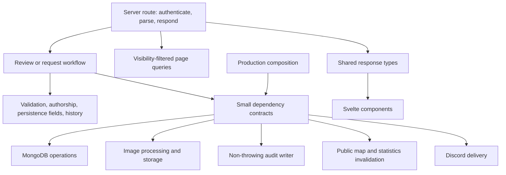

# Architecture and rule ownership

The app uses functions and small dependency contracts. Routes handle SvelteKit requests;
workflows sequence business operations; focused helpers own rules; production adapters supply
MongoDB, image storage, auditing, and external delivery. Browser components never import server
modules, including for shared types.

## Boundaries

- [src/lib/server/reviews/](../src/lib/server/reviews/) contains review rules and create/edit workflows. `production.ts`
  supplies common write dependencies, while each route supplies its operation-specific database
  callbacks. Page loads continue to query their collections directly.
- [src/lib/server/map/](../src/lib/server/map/) separates address matching, Nominatim transport, geocode storage,
  marker assembly, and coordination. `review-map.ts` composes one production instance.
- [src/lib/server/review-requests/](../src/lib/server/review-requests/) separates request validation, delivery, rate-limit policy,
  and the submission workflow. The `/about` route keeps origin checks, parsing, and HTTP responses.
- [src/lib/server/login/](../src/lib/server/login/) owns credential verification and the dependency-free password policy.
  The login route owns rate-limit order, auditing, sessions, and cookies.
- [src/lib/server/review-feed.ts](../src/lib/server/review-feed.ts) loads projected public reviews, derives
  publication dates from history, and builds RSS with stable review IDs. `/feed.xml` owns HTTP
  responses, including five-minute caching, ETags, conditional requests, and uncached failures.
  RSS anchors use `data-sveltekit-reload` so navigation and hover preloading cannot treat the
  endpoint as a review page through the client router's dynamic slug route.
- [src/lib/types/](../src/lib/types/) contains shared data contracts. `BarReviewUpdate` allows only editable
  review fields, an optional replacement image, and the update time. Publication has a separate
  update contract.
- [src/lib/components/review-form/](../src/lib/components/review-form/) owns the individual beer, attribute, author, rating, and image controls.
  The parent owns submission, initial/restored values, and error focus. Image object URLs belong
  to the image picker and are revoked when replaced or destroyed.
- [src/lib/components/review-map/](../src/lib/components/review-map/) owns marker and browser-location lifetimes. The parent keeps
  MapLibre initialization, worker setup, selection state, visible feedback, and disposal.

- [src/lib/server/api/](../src/lib/server/api/) serves the native client API in `src/routes/api/v1/`.
  It validates JSON against [openapi/v1.yaml](../openapi/v1.yaml), converts it for the shared
  workflows, and maps results to problem responses. See [the API notes](api.md).
- `reviews/publish.ts`, `login/login.ts` and `review-image-response.ts` hold the publish, login
  and image-read sequences shared by the web routes and the API. `production.ts` files next to
  them compose the production dependencies once.

Small cohesive modules such as publication, auditing, image processing, and the two rate limiters
remain separate. Their distinct policies are not combined into a general-purpose framework.

## Request flows

### Create and edit

The route authenticates, records the attempt, parses multipart data, and invokes the relevant
workflow. Workflows accept `FormData`, editor context, and narrow dependencies; they return
`ReviewWriteResult`. Only routes and the response adapter use SvelteKit `fail` or redirects.

Both flows validate fields, validate selected authors, check slug collisions, process an image,
and persist. Create validates ratings before detail fields, requires an image, and inserts a
draft. Edit first verifies the submitted ID against the route slug, validates details before
ratings, permits no replacement image, records changes, and preserves publication status.

An insert/update failure cleans up only the new upload. Both proactive slug checks and MongoDB
code `11000` retain their existing responses. Successful public edits invalidate the public caches;
draft writes do not. Audits remain next to their original decision points, with unchanged event
names, reasons, and order. Audit storage errors never break a request.

### Publication

The detail-page action uses only the route slug. `publishDraftReview` checks the draft's previous
status and update time in the atomic write. It records the publisher in history without changing
credited authors. A successful publication invalidates both public caches; conflicts retain their
existing HTTP responses. Missing publication status remains public for legacy records.

### Public RSS

The feed route supplies MongoDB and the request origin to the server-only feed service. The service
queries `PUBLIC_REVIEW_FILTER` with a projection containing only announcement and publication-history
fields, regardless of authentication. It uses the earliest draft-to-published history date, falling
back to creation only when there is no publication history, and excludes reviews without a valid
date. It sorts by publication date and review ID descending before taking the latest 50 entries.

Each announcement uses the review ID as a stable GUID, an absolute review link, and safely encoded
Swedish text. Edits may change the announcement and link but never its GUID or publication date.
The route hashes the XML for its ETag and handles five-minute HTTP caching, bodyless conditional
304 responses, and Swedish 503 errors with `no-store`. No process cache or publication write changes
are needed. Discovery uses the global layout head and the FAQ's native-navigation RSS link.

### Public map and statistics

Each production cache is created once per Node process with `createAsyncCache`. Concurrent reads
share pending work. Invalidating a cache advances its generation, so older work can finish for its
original caller but cannot refill the cache or clear a newer pending request. Failed reads can be
retried. The TTL starts when loading finishes.

Marker-list loading queries only public reviews and persisted resolved geocodes. It never calls
Nominatim. The authenticated, same-origin next-marker endpoint asks the map service for at most one
address attempt. Concurrent geocoding calls return no marker while another attempt is active;
they do not share the first call's result. Exact and fallback requests use the same Nominatim
client and timing state. Resolved geocodes remain permanent.

### Review requests and login

The review-request route checks origin and parses data. The workflow handles the honeypot,
validation, IP limit, global delivery limit, delivery, and auditing in their existing order.
It returns response data and an optional retry delay; the route writes the `Retry-After` header.
Delivery uses mocked HTTP in tests and never a real Discord webhook.

Login consumes IP and username rate limits before calling `verifyLoginCredentials`. Unknown
usernames still incur Argon2 hashing. The app and user-creation script import the same ESM policy;
the Docker runtime explicitly includes it for the standalone script. Passwords and request content
are not added to audit events. Login and review-request rate limits retain different algorithms
and failure behavior.

### Bar attributes and filtering

Bar activities and amenities use the shared [src/lib/bar-attributes.ts](../src/lib/bar-attributes.ts)
metadata and normalization rules, with browser-facing keys in `lib/types/bar-attributes.ts`.
The review form, persistence, history, and map marker loaders carry these values. Missing
attributes on legacy reviews mean an empty selection. Form parsing drops unknown keys,
deduplicates selections in metadata order, and persists the whole selection, including `[]`.
Validation failures restore the submitted selection; history uses Swedish attribute labels.

Home and map filters match any selected attribute and retain their selections in repeated
`attributes` URL parameters. Writable derived values initialize search, sort, and filters during
server rendering, allow local interaction, and follow new page data without synchronization effects.
The home loader returns the complete visibility-filtered collection so removing a direct-link
filter restores all reviews. Map filtering operates on the cached public marker collection
without geocoding or camera changes. Filters start collapsed behind a SlidersHorizontal icon
button with an active-selection count; attribute pills contain only text.

Home cards retain their identities across filtering, search text is indexed once per dataset,
and sorting is independent of filter changes. Map synchronization retains marker elements and
updates positions only when coordinates or offsets change. Refreshed marker titles, prices,
tooltips, accessible descriptions, and selected previews follow the current marker data.
Removing a selected marker closes its preview.

## Rule-to-test index

Paths below are relative to the repository root. Unit tests live beside the modules they cover.

| Rule or behavior                                                            | Implementation owner                                                                                                                                               | Regression coverage                                                                                                                                                                                                               |
| --------------------------------------------------------------------------- | ------------------------------------------------------------------------------------------------------------------------------------------------------------------ | --------------------------------------------------------------------------------------------------------------------------------------------------------------------------------------------------------------------------------- |
| Rating metadata and weighting                                               | [src/lib/review-metadata.ts](../src/lib/review-metadata.ts), [src/lib/utils/ratings.ts](../src/lib/utils/ratings.ts)                                               | [src/lib/utils/ratings.test.ts](../src/lib/utils/ratings.test.ts), [src/lib/server/reviews/form.test.ts](../src/lib/server/reviews/form.test.ts)                                                                                  |
| Bar attributes, OR filters, URL state, restored selections                  | [src/lib/bar-attributes.ts](../src/lib/bar-attributes.ts), `review-form/AttributeSelection.svelte`, `BarAttributeFilters.svelte`, review workflows and map loaders | Adjacent normalization, form, persistence, history, serialization, and map service tests; [tests/bar-attributes.test.ts](../tests/bar-attributes.test.ts), [tests/draft-reviews.test.ts](../tests/draft-reviews.test.ts)          |
| Review price comparisons and trend calculations                             | `src/lib/server/reviews/price-comparison.ts`, `src/lib/utils/price-comparison.ts`, `src/lib/types/price-comparison.ts`                                             | Adjacent loader and calculation tests                                                                                                                                                                                             |
| Text normalization and distinct slug policies                               | [src/lib/utils/review-text.ts](../src/lib/utils/review-text.ts), [src/lib/utils/slug.ts](../src/lib/utils/slug.ts)                                                 | Adjacent text and slug tests                                                                                                                                                                                                      |
| Validation order and restored form values                                   | [src/lib/server/reviews/form.ts](../src/lib/server/reviews/form.ts), [src/lib/utils/review-form.ts](../src/lib/utils/review-form.ts)                               | Adjacent tests, [src/routes/review-actions.test.ts](../src/routes/review-actions.test.ts)                                                                                                                                         |
| Selected authors and existing credits                                       | [src/lib/server/reviews/authorship.ts](../src/lib/server/reviews/authorship.ts)                                                                                    | Adjacent tests, [tests/review-authorship.test.ts](../tests/review-authorship.test.ts)                                                                                                                                             |
| Editable fields and history                                                 | [src/lib/server/reviews/persistence.ts](../src/lib/server/reviews/persistence.ts), [src/lib/server/reviews/history.ts](../src/lib/server/reviews/history.ts)       | Adjacent tests                                                                                                                                                                                                                    |
| Write failures, image cleanup, status preservation                          | [src/lib/server/reviews/create.ts](../src/lib/server/reviews/create.ts), [src/lib/server/reviews/edit.ts](../src/lib/server/reviews/edit.ts)                       | [src/lib/server/reviews/workflows.test.ts](../src/lib/server/reviews/workflows.test.ts), [src/routes/review-actions.test.ts](../src/routes/review-actions.test.ts), [tests/draft-reviews.test.ts](../tests/draft-reviews.test.ts) |
| Visibility and atomic publication                                           | [src/lib/server/review-publication.ts](../src/lib/server/review-publication.ts)                                                                                    | Adjacent tests, [tests/draft-reviews.test.ts](../tests/draft-reviews.test.ts)                                                                                                                                                     |
| Public RSS, publication dates, stable entry identity, HTTP validators       | [src/lib/server/review-feed.ts](../src/lib/server/review-feed.ts), `/feed.xml`                                                                                     | Adjacent unit tests, route failure tests, [tests/review-feed.test.ts](../tests/review-feed.test.ts)                                                                                                                               |
| Image signatures, metadata removal, directories                             | [src/lib/server/review-images.ts](../src/lib/server/review-images.ts)                                                                                              | Adjacent tests; draft/public access in browser publication tests                                                                                                                                                                  |
| Cache expiry, concurrency, stale results, retries                           | [src/lib/server/async-cache.ts](../src/lib/server/async-cache.ts)                                                                                                  | Adjacent tests, statistics and map service tests                                                                                                                                                                                  |
| Strict public queries and geocoding policy                                  | [src/lib/server/map/](../src/lib/server/map/)                                                                                                                      | [src/lib/server/map/service.test.ts](../src/lib/server/map/service.test.ts)                                                                                                                                                       |
| Marker selection, refreshed data and prices, keyboard use, location cleanup | [src/lib/components/ReviewMap.svelte](../src/lib/components/ReviewMap.svelte), `review-map/`                                                                       | [tests/review-map.test.ts](../tests/review-map.test.ts), [tests/bar-attributes.test.ts](../tests/bar-attributes.test.ts)                                                                                                          |
| Login verification and shared hashing policy                                | [src/lib/server/login/](../src/lib/server/login/)                                                                                                                  | `credentials.test.ts`, login through browser review tests                                                                                                                                                                         |
| Origin, honeypot, rate limits, request delivery failures                    | [src/lib/server/review-requests/](../src/lib/server/review-requests/), `/about` action                                                                             | Adjacent validation/delivery tests, [src/routes/about/page.server.test.ts](../src/routes/about/page.server.test.ts), [tests/review-request.test.ts](../tests/review-request.test.ts)                                              |
| Audit failures and trusted proxy handling                                   | [src/lib/server/audit.ts](../src/lib/server/audit.ts), `request.ts`                                                                                                | Adjacent tests                                                                                                                                                                                                                    |

## Verification and safe extension

Run `npm run test:unit -- --run`, `npm run check`, and `npm run lint` for a change. Run
`npm run test:integration` for routes, UI, authentication, and workflows. Its managed web server
also builds the app. Run `npm run build` for final production verification.

Browser feature specs share a worker-scoped MongoDB fixture and run with one worker because the
app has process caches and shared rate limits. Use a development/test database: the existing
fixture temporarily clears login limits and restores them on cleanup. Browser helpers live under
[tests/fixtures/](../tests/fixtures/); a spec should import only the fixtures it needs.

Add rules to their owning module and tests, then update this index when ownership changes. Keep
runtime dependencies out of pure rules. Factories and dependency objects provide test seams;
there is no dependency-injection container or generic repository hierarchy.
